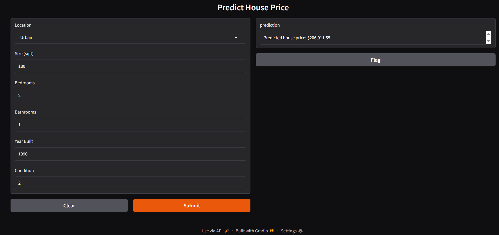

# 🏠 House Price Prediction


## 📋 نظرة عامة
تطبيق للتعلم الآلي يتوقع سعر المنزل بناءً على خصائصه.

## 🎯 المدخلات
- **Location**: Urban/Rural
- **Size (sqft)**: المساحة بالقدم المربع
- **Bedrooms**: عدد غرف النوم
- **Bathrooms**: عدد الحمامات
- **Year Built**: سنة البناء
- **Condition**: حالة المنزل (1-5)

## 💰 المخرجات
- سعر المنزل المتوقع

## 🖼️ صورة المشروع


## 🚀 كيفية التشغيل
```bash
pip install -r requirements.txt
python app.py
```