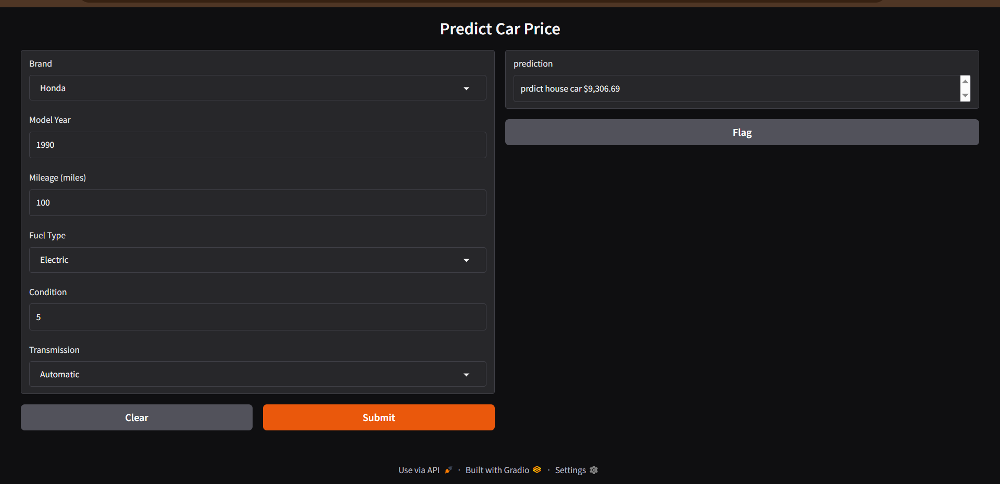

# 🚗 Car Price Prediction


## 📋 نظرة عامة
تطبيق للتعلم الآلي يتوقع سعر السيارة المستعملة.

## 🎯 المدخلات
- **Brand**: الماركة
- **Model Year**: سنة الموديل
- **Mileage**: عدد الأميال
- **Fuel Type**: نوع الوقود
- **Condition**: الحالة (1-5)
- **Transmission**: نوع ناقل الحركة

## 💰 المخرجات
- سعر السيارة المتوقع

## 🖼️ صورة المشروع


## 🚀 كيفية التشغيل
```bash
pip install -r requirements.txt
python app.py
```