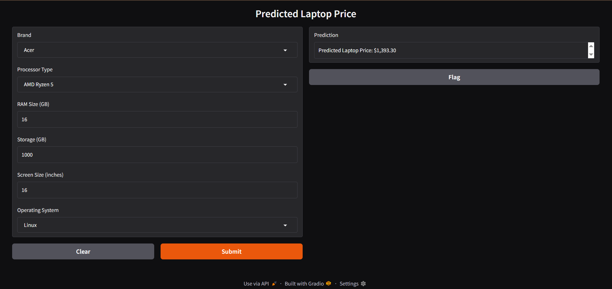

# 💻 Laptop Price Prediction


## 📋 نظرة عامة
تطبيق للتعلم الآلي يتوقع سعر اللاب توب بناءً على المواصفات.

## 🎯 المدخلات
- **Brand**: الماركة
- **Processor Type**: نوع المعالج
- **RAM Size**: حجم الرام (GB)
- **Storage**: مساحة التخزين (GB)
- **Screen Size**: حجم الشاشة (inches)
- **Operating System**: نظام التشغيل

## 💰 المخرجات
- سعر اللاب توب المتوقع

## 🖼️ صورة المشروع


## 🚀 كيفية التشغيل
```bash
pip install -r requirements.txt
python app.py
```