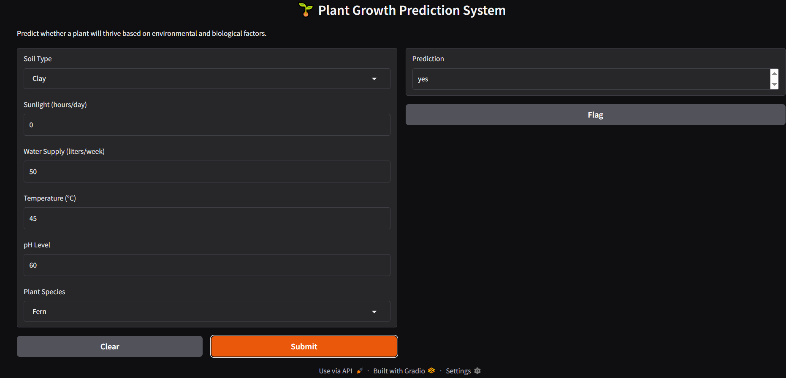

# 🌱 Plant Growth Prediction System


## 📋 نظرة عامة
تطبيق للتعلم الآلي يتوقع ما إذا كان النبات سينمو بنجاح بناءً على العوامل البيئية.

## 🎯 المدخلات
- **Soil Type**: نوع التربة
- **Sunlight**: ساعات الشمس (hours/day)
- **Water Supply**: كمية المياه (liters/week)
- **Temperature**: درجة الحرارة (°C)
- **pH Level**: مستوى الحموضة
- **Plant Species**: نوع النبات

## 🌿 المخرجات
- توقع نمو النبات

## 🖼️ صورة المشروع


## 🚀 كيفية التشغيل
```bash
pip install -r requirements.txt
python app.py
```